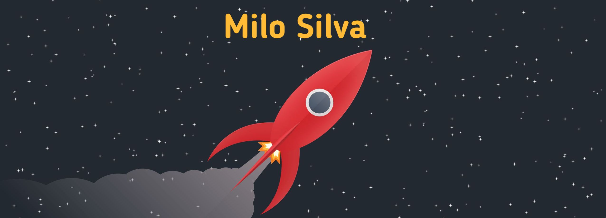

## :seedling: Projects I’m working on

##### 🎬 [movieMatch](https://github.com/Mr0cket/movieMatch) - A native mobile app to make choosing movies fun! [React-Native, Socket.Io, Firebase]
  - App: https://github.com/Mr0cket/movieMatch
  - Backend: https://github.com/Mr0cket/movieMatch-backend
 

##### 💬 [Dazn Chat](https://github.com/Mr0cket/dazn-chat) - A chrome extension for users to interact while watching the same sports event on [DAZN](https://www.dazn.com/). [Socket.io, Chrome Manifest V3]
  - Extension: https://github.com/Mr0cket/dazn-chat
  - Backend: https://github.com/Mr0cket/dazn-chat-server
  - Try out Extension: 

## :deciduous_tree: Completed Projects:

##### movie-search App [APIs, React]
  - app: https://github.com/Mr0cket/movie-search

#####  Steam Account Switcher - Automatically Switch between Steam accounts! [windows script, registry]
  - source: https://github.com/Mr0cket/Steam-Account-Switcher
  - My first project!

#### Get in Touch
  

<!--
**Mr0cket/Mr0cket** is a ✨ _special_ ✨ repository because its `README.md` (this file) appears on your GitHub profile.

Here are some ideas to get you started:

- 🔭 I’m currently working on ...
- 🌱 I’m currently learning ...
- 👯 I’m looking to collaborate on ...
- 🤔 I’m looking for help with ...
- 💬 Ask me about ...
- 📫 How to reach me: ...
- 😄 Pronouns: ...
- ⚡ Fun fact: ...
-->
